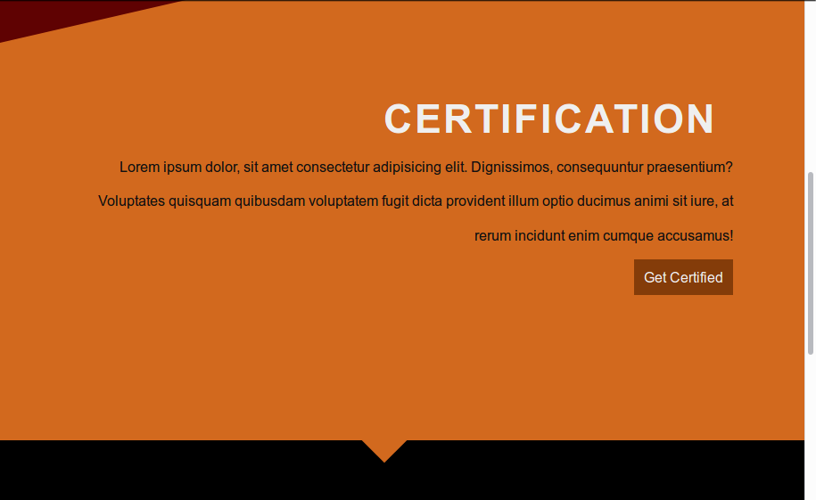

# CSS 21

## About

The CSS 21 is a project that takes you through 21 different projects within 21 days, all projects are written and designed with css3 unless otherwise stated.

## How to use

CSS 21 is free to use, it helps newbies and beginners to get to know 'the how' to make it work.

## What we cover

We would cover

- Layouts (Grids, flexbox and the good old ways).
- Positioning (Absolute & Relative).
- Psuedo styling (:after, :befor, :hover, :focus, :active etc).
- Transitions.
- Animations (@keyframes).
- Transform (rotate(), scale(), skew(), translate()).
- clip-path

## The Team

- Phavor Sparks **aka** *Fay Vor* (phavorsparks@gmail.com)
- Berna May **aka** *Bern* (EzeBernadine@gmail.com)
- Ezekiel Nnochiri **aka** *Eazi Blanc* (ezekielblanc@gmail.com)

## Example

